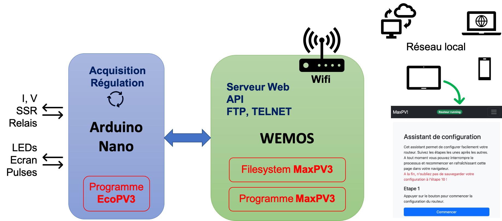
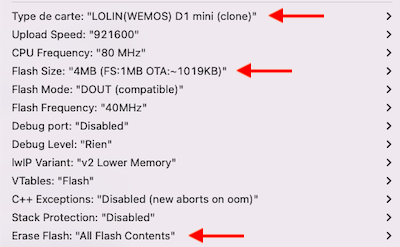
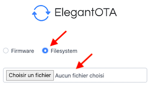
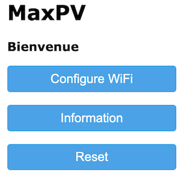

Vous aimez ce projet ? Vous pouvez m'encourager grâce au bouton **Sponsor** dans la barre ci-dessus !
Merci à tous pour vos messages et votre soutien au projet !

# MaxPV!
MaxPV! est une nouvelle interface pour EcoPV, compatible avec les montages EcoPV basés sur l'Arduino Nano et sur le Wemos ESP8266 pour la liaison Wifi. MaxPV! apporte une interface Web de configuration et de visualisation du fonctionnement, ainsi qu'une nouvelle API.

  
MaxPV! hérite d'EcoPV et de son algorithme de routage. Il sera utile de se référer au dépôt EcoPV : https://github.com/Jetblack31/EcoPV

La lecture de ces fils de discussion est plus que recommandée pour la mise en oeuvre :  
* Forum photovoltaïque, discussion sur MaxPV : https://forum-photovoltaique.fr/viewtopic.php?f=110&t=55244 
* Forum photovoltaïque, discussion sur EcoPV : https://forum-photovoltaique.fr/viewtopic.php?f=110&t=42721  
* Forum photovoltaïque, réalisation d'un PCB : https://forum-photovoltaique.fr/viewtopic.php?f=110&t=42874  
* Forum photovoltaïque, montage du PCB : https://forum-photovoltaique.fr/viewtopic.php?f=110&t=43197  

## Mise en garde  
Les programmes et les schémas proposés ont une vocation informative et pédagogique. Ils ont été testés avec succès par les auteurs. Cependant les auteurs de ces programmes et de ces schémas déclinent toute responsabilité. Les auteurs ne pourraient être tenus pour responsables du fonctionnement et des conséquences de l'utilisation des programmes et des schémas mis à disposition.  
Intervenir sur des circuits électriques est dangereux et nécessite le recours à une personne qualifiée et le respect strict des normes de sécurité et de protection en vigueur.

## Caractérisitiques de MaxPV! et changements par rapport à EcoPV
* Même qualité de routage du surplus photovoltaïque.
* Abandon de l'option de communication MySensors.
* Abandon de l'utilisation du shield ethernet. Toutefois, celui-ci peut rester en place sur le circuit mais il ne sera plus utilisé.
* Interface web responsive avec visualisation graphique des données.
* Installation et paramétrage réseau facilitée.
* Mise à jour du Wemos en OTA.
* Assistant de configuration des paramètres du routeur.
* Amélioration des index de comptage de la puissance.
* Le SSR et le relais secondaire de délestage peuvent être forcés sur arrêt permanent, marche permanente, en plus du mode automatique (par défaut).
* Nouvelle API pour communiquer avec un serveur domotique : [Documentation API](Documentation%20API/API_MaxPV.pdf).
* En développement : compteurs journaliers, historique des données.

## Synoptique

# Installation
## Pré-requis
L'installation de MaxPV! sur votre routeur EcoPV se fait par reprogrammation de l'Arduino Nano et du Wemos/ESP8266 par USB. Vous aurez besoin d'utiliser l'IDE Arduino avec le support pour les cartes ESP8266.
Le fonctionnement de MaxPV! nécessite une connexion à votre réseau local en Wifi avec une adresse IP statique. En cours d'installation, vous aurez besoin de vous connecter temporairement en Wifi au Wemos à l'aide d'un ordinateur portable ou d'un téléphone.

## Programmation de l'Arduino Nano
* **ATTENTION** : si vous migrez un système EcoPV existant, prenez note des paramètres du routeur ! Ceux-ci seront effacés et devront être ré-introduits à la fin de l'installation !
* Ouvrez le programme *EcoPV3.ino* dans l'IDE de l'Arduino configuré pour la programmation de l'Arduino Nano.
* Si vous utilisez l'écran oLed, dé-commentez la ligne 47 du code et vérifiez que la bibliothèque SSD1306Ascii est bien installée.
* Téléchargez le programme dans l'Arduino Nano.

## Programmation du Wemos
* Configurez l'IDE Arduino sur la carte "Wemos D1 mini clone" avec les paramètres suivants : 
  * **Flash size: 4 MB (FS: 1MB, OTA: 1019KB)**,
  * **Erase Flash: All Flash Contents**

* Installez la librairie **AsyncElegantOTA** à partir du gestionnaire de librairies.
* Installez les 2 librairies disponibles dans le répertoire **"Librairies IDE"**.
* Ouvrez le programme *amorceESP.ino* et téléchargez le dans le Wemos.
* A l'aide d'un ordinateur connectez-vous au réseau Wifi MaxPV créé par le Wemos et allez à la page http://192.168.4.1
* Une page intitulée elegantOTA s'ouvre à l'écran.
* Téléchargez d'abord le **Filesystem** *MaxPV3_filesystem.bin* disponible dans le répertoire **"Binaires MaxPV"**.

* Le Wemos reboote, connectez-vous de nouveau au réseau Wifi MaxPv.
* Téléchargez ensuite le **Firmware** *MaxPV3_firmware.bin* disponible dans le répertoire **"Binaires MaxPV"**.

* Le Wemos reboote, connectez-vous de nouveau au réseau Wifi MaxPv.
* Un portail captif s'ouvre, s'il ne s'ouvre pas automatiquement, connectez-vous à l'adresse http://192.168.4.1

* Réalisez votre configuration Wifi et votre configuration IP. Pour les adresses DNS, indiquez l'adresse de votre 'Box internet' comme DNS1, et l'adresse 8.8.8.8 comme DNS2.
* Vous pouvez maintenant ré-installer l'Arduino Nano et le Wemos sur la carte électronique de votre routeur.

## Premier démarrage
* Vérifiez que votre ordinateur / téléphone est bien connecté à votre réseau local.
* Connectez-vous à l'adresse IP statique que vous avez attribuée au Wemos au cours de l'installation.
* La page d'accueil de MaxPV! s'ouvre. Vous pouvez vérifiez que l'Arduino Nano fonctionne correctement par l'indication **Routeur running** en haut de la page.
* Si vous êtes nouvel utilisateur de MaxPV!, rendez-vous sur la page **Assistant de configuration** et laissez-vous guider.
* Si vous voulez entrer manuellement les paramètres du routeur que vous utilisiez précédemment :
  * Rendez-vous sur la page **Paramètrage avancé**,
  * Entrez vos paramètres un par un, en validant chaque paramètre,
  * **Attention** : il y a 2 nouveaux paramètres :
    * **P_INSTALLPV** : puissance de votre installation photovoltaïque en Wc,
    * **CNT_CALIB** : poids des impulsions en Wh du compteur d'impulsion pour la mesure de la production PV,
  * Mettez à 0 les index des compteurs.
  * **Enregistrez la configuration et redémarrez le routeur**.
* Votre routeur MaxPV! est maintenant opérationnel !
* A tout moment, vous pouvez modifier les paramètres du routeur en utilisant de nouveau l'assistant de configuration ou en utilisant le paramétrage avancé.

## Mises à jour
Les mises à jour de MaxPV! sur le Wemos se font par Wifi en OTA via la page **Update** de l'interface. **Attention** : la mise à jour du filesystem nécessitera de reconfigurer la connexion Wifi du Wemos comme décrit précédemment. Pour les mises à jour, **l'ordre à suivre est** : mise à jour du firmware puis du filesystem. En cas d'échec de la mise à jour, utilisez la procédure Programmation du Wemos ci-dessus.

Les mises à jour de l'Arduino se font par USB comme décrit ci-dessus dans l'installation.

## Installation avancée
Si vous souhaitez compiler le firmware et le filesystem du Wemos pour réaliser une installation personnalisée, les codes sources sont disponibles dans le répertoire **"MaxPV3"**.

# Tech zone
## Explication du mode de fonctionnement des sorties SSR et du relais secondaire
Le mode de fonctionnement normal des sorties SSR et relais secondaire est le **mode AUTO**. Dans ce mode, le routeur s'occupe de diriger le surplus de production photovoltaïque vers la résistance du chauffe-eau et la charge secondaire de délestage éventuellement connectée au relais. 
Toutefois, vous pouvez forcer la marche du SSR et/ou du relais, il vous suffit de sélectionner le mode FORCE dans l'onglet Moniteur de MaxPV! ou via une requête API. De même, vous pouvez empêcher le fonctionnement du SSR et/ou du relais en sélectionnant le mode STOP.

**ATTENTION** : il y a une limitation au fonctionnement. Le mode AUTO du relais ne peut fonctionner que si le SSR est en mode AUTO. Si le SSR n'est pas en mode AUTO et si le relais est en mode AUTO, alors le relais sera desactivé en permanence.

## API
L'API permet d'interfacer MaxPV! avec des systèmes externes comme un système de domotique. L'API a été revue en profondeur comparativement à la version précédente de EcoPV. L'API est décrite dans la [Documentation API](Documentation%20API/API_MaxPV.pdf).

## Accès au système de fichiers par FTP
Vous pouvez accéder au système de fichiers du Wemos par connexion FTP sur le port 21. L'identifiant est *maxpv*, mot de passe *maxpv*. ATTENTION : le serveur ne supporte qu'une seule connexion simultanée, veillez à configurer votre client FTP en conséquence.

## Accès TELNET
Un accès TELNET est disponible sur le port 23. Vous aurez alors accès à des informations de debug, en particulier l'échange de messsages de l'Arduino Nano vers le Wemos.

## Allocation des pins de l'Arduino Nano
Les pins d'entrée-sortie de l'Arduino Nano sont configurables dans le code EcoPV3 en fonction du développement de votre circuit électronique. Il y a toutefois certaines contraintes résumées dans le tableau ci-dessous.

# Versions
### **V 3.1** - 13/08/2022
* Petites corrections dans EcoPV
* Ajout du graphique historique par pas de 30 minutes sur 4 jours (96h) dans MaxPV!
* Ajout de fonctionnalités à l'API
### **V 3.0.2** - 08/08/2022
* Amélioration du traitement de la liaison série dans EcoPV
* Ajout d'un bargraph dans l'assistant de calibrage
* Optimisation du site Web
* Ajout de la vérification d'une mise à jour disponible sur la page d'accueil
### **V 3.0.1** - 31/07/2022
* Correction d'un bug mineur mode STOP SSR
* Ajout de graphiques
### **V 3.0**   - 30/07/2022
* Version intiale

